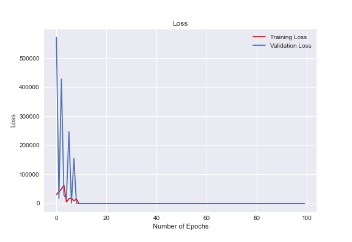
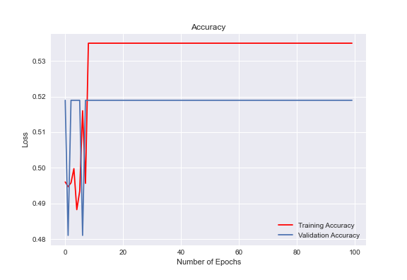

# Neural Network Charity Analysis Archive

This repository preserves a 2021 collection of TensorFlow/Keras learning
notebooks. Its primary exercise trains a binary classifier for the historical
`IS_SUCCESSFUL` field in a charity-applicant dataset; supporting notebooks
explore preprocessing and tabular neural-network concepts on other snapshots.

## Project status

This is a **historical learning archive**, not a maintained model, inference
service, current charity dataset, or reproducible training pipeline. The
repository has no dependency manifest, lockfile, environment export, model
card, automated training job, or held-out evaluation contract.

Saved notebook outputs and 19 TensorFlow SavedModel directories are retained as
historical artifacts. They have not been loaded or evaluated on a current
TensorFlow runtime. Do not treat a saved metric, chart, or model directory as
evidence of present-day accuracy, fairness, calibration, or production fitness.

## Repository map

| Path | Historical role |
| --- | --- |
| `AlphabetSoupCharity.ipynb` | Baseline charity-applicant preprocessing and classifier exercise |
| `AlphabetSoupCharity-Optimzation.ipynb` | Historical optimization experiments; the filename typo is preserved for traceability |
| `01-Keras-Intro.ipynb` | Introductory Keras exercises |
| `02-Ramen-Ratings.ipynb` | Categorical preprocessing exercise |
| `03-Standardize.ipynb` | Feature-standardization exercise |
| `04-DeepLearning-Tabular.ipynb` | Tabular attrition-classification exercise |
| `data/` | Four third-party CSV snapshots used by the notebooks |
| `models/` | Nineteen preserved TensorFlow SavedModel directory trees |
| `resources/` | Historical accuracy and loss charts |
| `scripts/check_repository.py` | Dependency-free structural validation; it never imports TensorFlow or loads a model |

## Validate the archive

Run the complete repository gate with Python 3.11 or newer:

```sh
python3 scripts/check_repository.py
```

The validator:

- parses all six notebooks as notebook-format JSON without executing cells;
- verifies the four committed CSV schemas and non-empty data rows;
- checks the exact inventory and file structure of all 19 SavedModel artifacts;
- rejects pickle, joblib, and HDF5 model formats from this bounded archive; and
- enforces a 10 MiB per-file ceiling so artifact growth is reviewed explicitly.

A passing gate proves structural integrity only. It does not deserialize a
model, reproduce training, validate saved outputs, or establish rights to use
the datasets.

## Safety and evaluation boundary

Serialized models are executable-computation artifacts. Load them only in an
isolated environment after reviewing their origin and framework compatibility.
Do not expose these models through an API or use their outputs for funding,
employment, eligibility, or other consequential decisions.

A maintained successor would need, at minimum, a pinned and scanned dependency
graph, an explicit train/validation/test split, reproducible preprocessing,
data-version and feature lineage, leakage checks, subgroup and calibration
evaluation, a model card, and a human-reviewed use policy.

## Data rights and provenance

The CSV files are historical third-party snapshots. Their exact upstream
versions, retrieval dates, licenses, and redistribution permissions are not
sufficiently documented here. Access to a dataset is not permission to collect,
persist, model, or republish it.

Before reuse, establish file-level provenance and current terms, then validate
that the proposed use is permitted. Tests and CI must remain offline and use
only the committed archive or synthetic fixtures.

## Historical charts





These images are saved outputs from the original exercise, not a current model
evaluation.

## License

Repository-authored material is available under the [MIT License](LICENSE).
That license does not grant rights to third-party datasets or model inputs.
